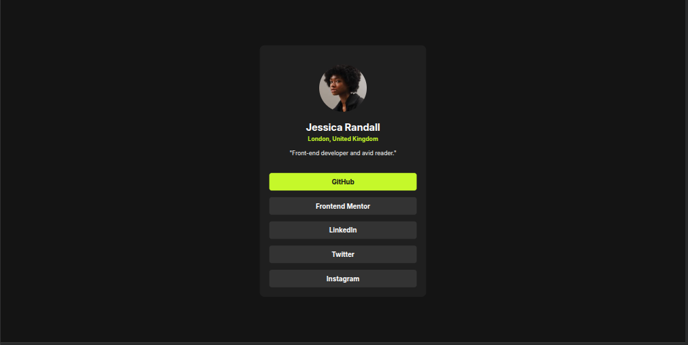
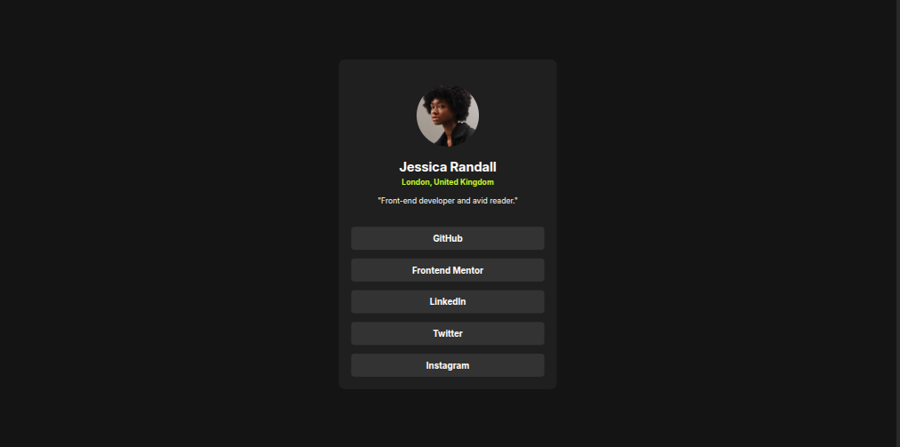

# Frontend Mentor - Social links profile solution

This is a solution to the [Social links profile challenge on Frontend Mentor](https://www.frontendmentor.io/challenges/social-links-profile-UG32l9m6dQ). Frontend Mentor challenges help you improve your coding skills by building realistic projects.

## Table of contents

- [The challenge](#the-challenge)
- [Screenshot](#screenshot)
- [Links](#links)
- [Built with](#built-with)
- [Continued development](#continued-development)
- [Useful resources](#useful-resources)
- [Author](#author)

### The challenge

 : hover state of button

### Screenshot

### Links

- Solution URL: [Add solution URL here](https://your-solution-url.com)
- Live Site URL: [Add live site URL here](https://your-live-site-url.com)

### Built with

- Semantic HTML5 markup
- CSS custom properties
- Flexbox
- Mobile-first workflow
- media query

### Continued development

Next, I would like to deepen my understanding of:

- Media queries for building fully responsive designs.
- Relative units in CSS to improve scalability across different screen sizes.

If you have any resources that could help me, please feel free to share!

### Useful resources

[Coder coder](https://www.youtube.com/@TheCoderCoder)Helpful videos for beginner-friendly HTML and CSS concepts.

[Super Simple dev](https://www.youtube.com/@SuperSimpleDev)
Clear and beginner-friendly explanations on CSS layout and workflow.

## Author

- Frontend Mentor - [@Jeanclaude09-dev](https://www.frontendmentor.io/profile/Jeanclaude09-dev)
- GitHub - [@Jeanclaude09-dev](https://github.com/Jeanclaude09-dev)
- instagram - [@iamje_nclaude](https://www.instagram.com/iamje_nclaude)
